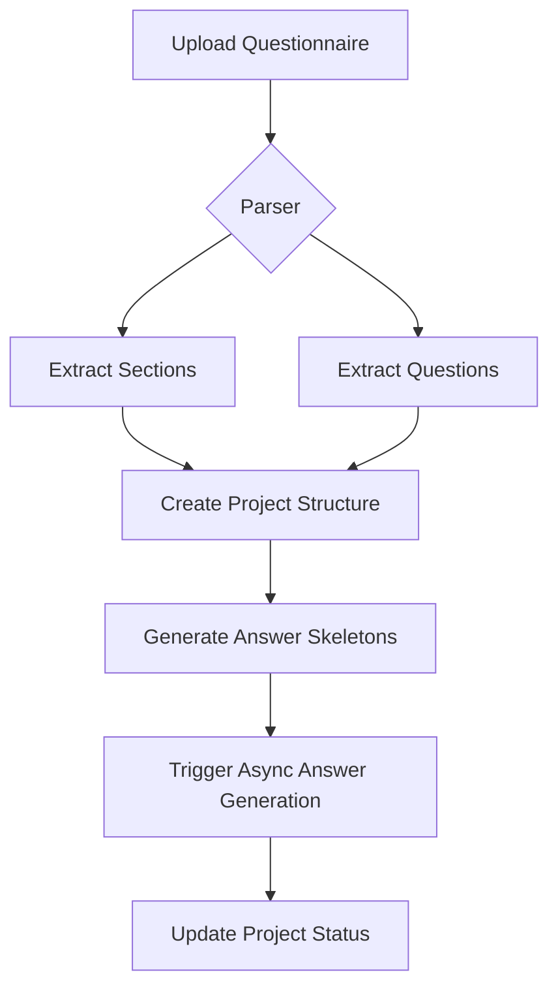
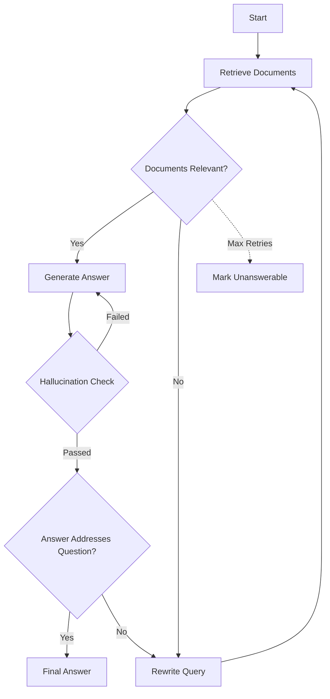
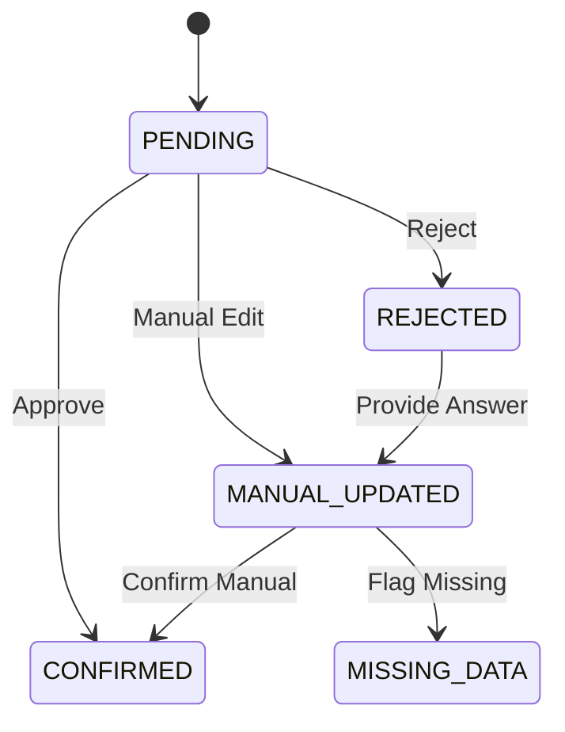
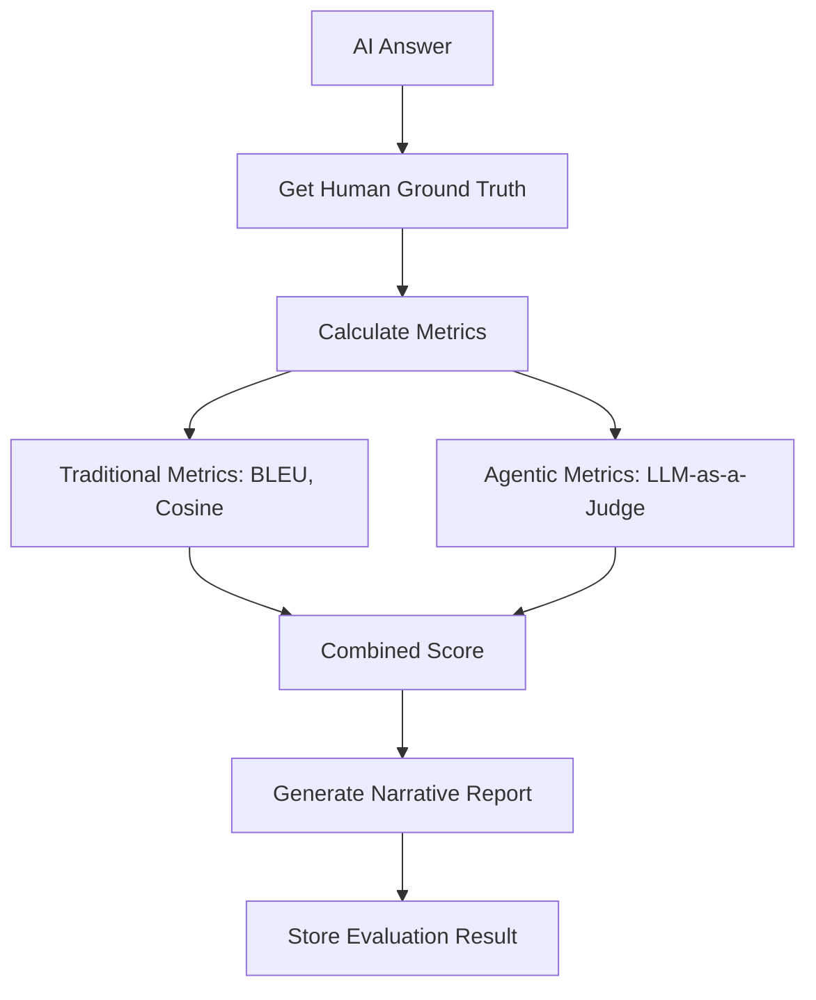

# Questionnaire Agent - Implementation Plan

## 1. Tech Stack Overview

### 1.1 Backend Stack

| Component | Technology | Purpose |
|-----------|------------|---------|
| Runtime | Python 3.11+ | Core application runtime |
| Web Framework | FastAPI | REST API framework with async support |
| Vector Database | FAISS | Semantic search and similarity indexing |
| Document Parsing | PyPDF2, python-docx, openpyxl, python-pptx | Multi-format document ingestion |
| LLM Integration | LangGraph, Gemini 2.5 Pro | Answer generation with citations |
| Embedding Model | Google Generative AI Embeddings | Generate vector embeddings for semantic search |
| Database | SQLite | Relational data persistence |
| Task Queue | Celery + SQLite | Async background processing (database-backed) |
| Storage | Local filesystem | Document and chunk storage |

### 1.2 Frontend Stack

| Component | Technology | Purpose |
|-----------|------------|---------|
| Framework | React 18+ | UI component library |
| Build Tool | Vite | Fast development server and bundler |
| Language | TypeScript 5+ | Type-safe development |
| HTTP Client | Axios | API communication |
| State Management | Redux | Server and client state |
| UI Components | Tailwind CSS + Headless UI | Styling and accessible components |

### 1.3 Development Environment

| Component | Technology | Purpose |
|-----------|------------|---------|
| Virtual Env | Python `venv` | Isolated execution environment |
| Dependency Management | `pip` | Package installation |
| Monitoring | Structured logging | Observability |

---

## 2. System Scopes

### 2.1 Core Functional Scopes

#### Scope 1: Document Ingestion & Indexing
- **Input**: PDF, DOCX, XLSX, PPTX files
- **Processing**: Text extraction, chunking with bounding box references
- **Output**: Multi-layer FAISS index with semantic and citation layers
- **Trigger**: Async document upload → indexing pipeline
- **Side Effect**: ALL_DOCS projects marked OUTDATED

#### Scope 2: Questionnaire Project Management
- **Entities**: Project, Section, Question, Answer, Document Reference
- **Lifecycle**: DRAFT → PROCESSING → READY → REVIEW → COMPLETED
- **Scope Types**: ALL_DOCS or specific document subset
- **Operations**: Create, Update, Delete, Clone projects

#### Scope 3: Answer Generation Engine
- **Input**: Question + indexed documents
- **Processing**: Semantic retrieval → LLM generation with citations
- **Output**: Answer text + chunk-level citations + confidence score
- **Fallback**: "Unable to answer" when no relevant documents found

#### Scope 4: Review & Manual Override Workflow
- **States**: PENDING → CONFIRMED → REJECTED → MANUAL_UPDATED → MISSING_DATA
- **Actions**: Approve, Reject, Manual Edit, Flag for Review
- **Audit**: Preserve AI and human answers for comparison

#### Scope 5: Evaluation Framework
- **Comparison**: AI-generated vs. Human ground-truth answers
- **Metrics**: Semantic similarity (embedding cosine) + Keyword overlap (Jaccard/BLEU)
- **Output**: Numeric score + qualitative explanation

### 2.2 Out of Scope (Future Consideration)
- Multi-user collaboration with permissions
- Advanced analytics and reporting dashboards
- Enterprise SSO and audit logs
- Dockerization and production deployment (PostgreSQL, S3)

---

## 3. Phase-by-Phase Implementation Plan

### Phase 1: Foundation & Data Model -- DONE
**Duration**: 2-3 weeks

#### Objectives
- Establish project structure and development environment
- Define complete data model and API contracts
- Implement core database entities

#### Deliverables
```
backend/
├── src/
│   ├── models/          # Pydantic schemas for all entities
│   │   ├── project.py   # Project, Section, Question models
│   │   ├── answer.py    # Answer, Citation, Confidence models
│   │   ├── document.py   # Document, Chunk, Index models
│   │   └── evaluation.py # Evaluation, Similarity models
│   ├── api/
│   │   └── routes/      # FastAPI route definitions
│   └── storage/
│       └── db/          # Database connection and migrations
```

#### Tasks
1. Set up FastAPI project with CORS, logging, and error handling
2. Define Pydantic models for all entities (Project, Document, Answer, Citation, Evaluation)
3. Create database schema with relationships and indexes
4. Implement CRUD operations for core entities
5. Set up local SQLite instance for task queueing
6. Create API endpoint stubs for all planned endpoints (aligned with modules.md)

#### API Endpoints (Phase 1)
```python
# Core endpoints (stub implementations)
POST /create-project-async          # Create project
GET /get-project-info               # List projects / Get summary
GET /get-project-status             # Get project status
GET /get-request-status             # Get async task status
```

#### Acceptance Criteria
- [ ] All data models defined with relationships
- [ ] Database schema created with SQLite
- [ ] API endpoints respond with correct schemas
- [ ] Development environment runs within `venv`

---

### Phase 2: Document Ingestion Pipeline
**Duration**: 2-3 weeks

#### Objectives
- Implement multi-format document parsing
- Build multi-layer FAISS indexing pipeline
- Handle document lifecycle and status tracking

#### Deliverables
```
backend/
├── src/
│   ├── services/ingestion/
│   │   ├── parsers/          # Format-specific parsers
│   │   │   ├── pdf.py        # PDF text and bbox extraction
│   │   │   ├── docx.py       # Word document parsing
│   │   │   ├── xlsx.py       # Excel spreadsheet parsing
│   │   │   └── pptx.py       # PowerPoint parsing
│   │   ├── chunking/         # Semantic chunking logic
│   │   │   └── splitter.py   # Overlapping chunk strategies
│   │   └── pipeline.py       # End-to-end ingestion workflow
│   ├── indexing/             # Multi-layer indexing pipeline
│   │   ├── layers/           # Multi-layer index
│   │   │   ├── semantic.py   # Semantic retrieval layer
│   │   │   └── citation.py   # Citation chunk layer
│   │   └── manager.py        # Index lifecycle management
│   └── storage/
│   	└── faiss_store.py    # FAISS vector store wrapper
```

#### Tasks
1. Implement PDF parser with text and bounding box extraction
2. Implement DOCX, XLSX, PPTX parsers
3. Build chunking strategy with configurable overlap
4. Create FAISS vector store with add/search/delete operations
5. Implement dual-layer index:
   - Layer 1: Semantic chunks for answer retrieval
   - Layer 2: Citation chunks with source references
6. Add document status tracking (UPLOADED → INDEXING → READY → ERROR)
7. Implement ALL_DOCS invalidation mechanism

#### Async Tasks (Celery)
```python
@celery.task
def index_document_async(document_id: str):
    """Background document indexing task"""
    # 1. Parse document
    # 2. Generate chunks
    # 3. Build embeddings
    # 4. Add to FAISS index
    # 5. Update document status
    # 6. Invalidate ALL_DOCS projects
```

#### Acceptance Criteria
- [ ] Documents in PDF, DOCX, XLSX, PPTX formats can be uploaded
- [ ] Text extraction preserves document structure
- [ ] Chunks include page/slide numbers and bounding boxes
- [ ] FAISS index supports semantic search with citations
- [ ] New documents trigger ALL_DOCS project invalidation
- [ ] Background task status is trackable via request IDs

---

### Phase 3: Questionnaire Parsing & Project Lifecycle
**Duration**: 2 weeks

#### Objectives
- Parse questionnaire files into structured data
- Implement async project creation and updates
- Handle automatic regeneration on configuration changes

#### Deliverables
```
backend/
├── src/
│   └── services/
│       ├── questionnaire/
│       │   ├── parser.py         # Questionnaire file parser
│       │   ├── models.py         # Questionnaire-specific models
│       │   └── converter.py       # Convert to project structure
│       ├── project_service.py  # Project business logic
│       └── lifecycle.py         # State machine transitions
```

#### Tasks
1. Implement questionnaire parser (PDF/DOCX format)
2. Extract sections, questions, and ordering
3. Build project creation async workflow
4. Implement configuration change detection
5. Add automatic answer regeneration on config changes
6. Handle project status transitions:
   - DRAFT → PROCESSING (on create/update)
   - PROCESSING → READY (when answers generated)
   - READY → OUTDATED (when source documents change)

#### Questionnaire Data Flow


#### Acceptance Criteria
- [ ] Questionnaire files parse into structured sections/questions
- [ ] Project creation is async with status tracking
- [ ] Configuration changes trigger regeneration
- [ ] ALL_DOCS projects transition to OUTDATED on new documents
- [ ] Project status accurately reflects progress

---

### Phase 4: Answer Generation Agent (LangGraph)
**Duration**: 3 weeks

#### Objectives
- Implement **agentic RAG workflow** using LangGraph
- Build robust retrieval with query expansion and self-correction
- Implement answer generation with strict citation requirements
- Calculate confidence scores and handle hallucinations

#### Deliverables
```
backend/
├── src/
│   └── services/
│       ├── retrieval/
│       │   ├── semantic.py         # Semantic search in FAISS
│       │   └── hybrid.py           # Hybrid retrieval strategy
│       ├── agent/                  # [NEW] LangGraph Agent
│       │   ├── graph.py            # Graph definition & compilation
│       │   ├── state.py            # Agent state definition
│       │   ├── nodes/              # Graph nodes
│       │   │   ├── retrieval.py    # Retrieve documents
│       │   │   ├── grade.py        # Grade relevance/hallucinations
│       │   │   └── generate.py     # Generate answer
│       │   └── chains/             # LCEL chains for specific tasks
│       └── answer_service.py       # Service entry point (runs the graph)
```

#### Tasks
1. Define Agent State (Question, Documents, Generation, RetryCount)
2. Implement retrieval node with hybrid search and re-ranking
3. Build document grading node (relevance check using LLM)
4. Create generation node (Gemini 2.5 with citation instructions)
5. Implement hallucination & answerability check node
6. Build LangGraph workflow with cycles:
    - If no relevant docs -> Rewrite query -> Retry retrieval
    - If hallucinated -> Retry generation
    - If unanswerable -> Fallback to "Unable to answer"
7. Integrate Graph compile into `AnswerService`
8. Implement confidence scoring based on retrieval quality and generation probability

#### Agentic Flow


#### Answer Output Structure
```python
class GeneratedAnswer(BaseModel):
    question_id: str
    answer_text: str
    is_answerable: bool
    confidence_score: float  # 0.0 - 1.0
    citations: List[Citation]
    source_chunks: List[str]
    processing_metadata: Dict[str, Any] # Graph trace info
```

#### Acceptance Criteria
- [ ] LangGraph agent handles retrieval and generation loops
- [ ] Relevance grader filters out irrelevant chunks
- [ ] Hallucination check verifies answer against documents
- [ ] Fallback mechanism for unanswerable questions works
- [ ] Citations are accurate and chunk-level
- [ ] Confidence scores reflect retrieval quality and generation certainty

---

### Phase 5: Review Workflow Implementation
**Duration**: 2 weeks

#### Objectives
- Build review interface for answer management
- Implement manual override capabilities
- **Enable Human-in-the-loop (HITL) refinement using LangGraph persistence**
- Preserve AI and human answers for comparison

#### Deliverables
```
backend/
├── src/
│   ├── services/
│   │   ├── review_service.py  # Review workflow logic
│   │   └── langgraph_persistence.py # SQL Checkpointer for LangGraph
│   └── api/
│       └── routes/
│           └── review.py      # Review endpoints
```

#### Review States


#### Tasks
1. Implement answer review endpoints
2. Build status transition logic
3. Add manual answer storage with AI comparison flag
4. Implement rejection with reason capture
5. Add missing data flagging workflow
6. Create audit trail for all review actions
7. **Configure LangGraph SQL Checkpointer** to persist agent state across requests
8. **Implement "Interactive Refinement"**: Allow users to provide natural language feedback to the agent to regenerate specific answers
9. **Expose Graph Trace**: Provide metadata about the agent's decision-making process (which nodes were visited, retrieval results) to the review interface

#### Review Endpoints
```python
POST /answers/{id}/confirm          # Confirm AI answer
POST /answers/{id}/reject            # Reject with reason
PUT /answers/{id}                    # Manual override
POST /answers/{id}/flag-missing      # Flag missing information
POST /answers/{id}/refine            # Refine answer using LangGraph HITL
GET /answers/{id}/history            # Get review history
GET /answers/{id}/trace              # Get LangGraph execution trace
```

#### Acceptance Criteria
- [ ] Review workflow states: CONFIRMED, REJECTED, MANUAL_UPDATED, MISSING_DATA
- [ ] Manual edits are preserved alongside AI results
- [ ] Rejection includes reason tracking
- [ ] Review history is auditable
- [ ] Status transitions are validated

---

### Phase 6: Evaluation Framework
**Duration**: 2 weeks

#### Objectives
- Implement comparison between AI and human answers
- Calculate semantic similarity metrics
- **Implement Agentic Evaluation (LLM-as-a-Judge)**
- Generate evaluation reports

#### Deliverables
```
backend/
├── src/
│   └── services/
│       ├── evaluation/
│       │   ├── similarity.py       # Similarity metrics
│       │   ├── comparator.py       # AI vs Human comparison
│       │   └── report.py           # Evaluation reporting
│       └── evaluation_service.py
```

#### Metrics Implementation
```python
class SimilarityMetrics(BaseModel):
    semantic_similarity: float    # Embedding cosine similarity
    keyword_overlap: float        # Jaccard index
    bleU_score: float            # BLEU-like token overlap
    agentic_score: float         # [NEW] LLM-based qualitative score
    combined_score: float        # Weighted combination
    explanation: str             # Qualitative assessment from LLM-Judge
```

#### Tasks
1. Implement embedding-based semantic similarity
2. Add keyword overlap metrics (Jaccard, TF-IDF)
3. Build combined scoring algorithm
4. Create evaluation comparison endpoints
5. Generate evaluation reports with visualizations
6. Add ground truth answer storage for comparison
7. **Implement LLM-as-a-Judge**: Create an evaluation agent that grades answers based on criteria like "Faithfulness", "Relevance", and "Conciseness"

#### Evaluation Flow


#### Acceptance Criteria
- [ ] AI answers compared to human ground truth
- [ ] Semantic similarity scores calculated
- [ ] Keyword overlap metrics computed
- [ ] Evaluation includes numeric score and explanation
- [ ] Reports are exportable

---

### Phase 7: Frontend Implementation
**Duration**: 4-5 weeks

#### Objectives
- Build complete UI for all workflows (Ingestion, Management, Review, Evaluation)
- **Visualize AI Reasoning**: Show citations, confidence scores, and graph execution traces
- **Enable Interactive Review**: Manual overrides, feedback-based regeneration (HITL)
- Create responsive and accessible interface

#### Deliverables
```
frontend/
├── src/
│   ├── pages/
│   │   ├── Dashboard.tsx       # Project overview & high-level metrics
│   │   ├── ProjectDetail.tsx   # Project structure (Section/Question tree)
│   │   ├── DocumentManager.tsx # Upload, Indexing Status, Deletion
│   │   ├── Evaluation.tsx      # Trigger runs & view reports
│   │   ├── CompareView.tsx     # Side-by-side AI vs Human review
│   │   └── RequestLog.tsx      # Async task monitoring
│   ├── components/
│   │   ├── Review/
│   │   │   ├── AnswerCard.tsx      # Answer display with confidence
│   │   │   ├── CitationViewer.tsx  # PDF Renderer with bounding-box highlights
│   │   │   ├── EditHistory.tsx     # View previous versions
│   │   │   └── FeedbackModal.tsx   # HITL input for regeneration
│   │   ├── Project/
│   │   │   ├── TreeNavigator.tsx   # Section/Question navigation
│   │   │   └── ImportWizard.tsx    # Questionnaire file import
│   │   └── Evaluation/
│   │       ├── ScoreCard.tsx       # Metric visualization
│   │       └── DiffViewer.tsx      # Text diff for answers
│   ├── services/
│   │   ├── api.ts              # Axios client
│   │   └── socket.ts           # WebSocket/Polling for live updates
│   └── stores/
│       ├── useProjectStore.ts
│       └── useUIStore.ts
```

#### Tasks
1. **Core Infrastructure**:
   - Set up React Router, Axios (with interceptors), and Toast notifications
   - Implement "Task Polling" hook for async operation status
2. **Document Management**:
   - Multi-file drag-and-drop upload
   - Progress bars for "Upload" and "Indexing" stages
   - "Processing... Ready" status indicators for documents
3. **Project & Questionnaire**:
   - Import Wizard: Upload Questionnaire -> Parse Preview -> Confirm Project Creation
   - Tree View Navigation: Sections -> Questions (color-coded by status: Empty, Draft, Review, Done)
4. **Answer Review Interface (Critical)**:
   - **Citation Linking**: Clicking a citation opens the PDF viewer and scrolls to the bounding box
   - **Confidence Badges**: Visual indicator (Green/Yellow/Red) based on score
   - **Manual Override**: Rich-text editor to modify AI answers
   - **HITL Refinement**: "Refine Answer" button opens modal to give natural language feedback to the Agent
   - **Review Actions**: Approve (locks answer), Reject (flags for redo), Flag Missing Data
5. **Evaluation Dashboard**:
   - Trigger "Compare w/ Ground Truth" runs
   - Scorecards for Semantic Similarity and Conciseness
   - "Diff View" showing AI Answer vs. Human Answer side-by-side
   - Export Reports to PDF/CSV

#### User Interface Mockup Concepts
- **Split Screen Review**: Left pane has Question & Answer; Right pane has Document Viewer
- **Trace Transparency**: "View Thought Process" button to show LangGraph node steps (optional advanced view)

#### Acceptance Criteria
- [ ] Document Manager shows real-time indexing status
- [ ] Questionnaire Tree accurately reflects parsed structure
- [ ] Clicking citations accurately highlights text in the PDF viewer
- [ ] Review Interface supports Editing, Approving, and Rejecting
- [ ] "Refine" action successfully triggers a LangGraph re-run with user feedback
- [ ] Evaluation reports quantify AI performance against Ground Truth

---

### Phase 8: Integration & Testing
**Duration**: 2 weeks

#### Objectives
- Integrate all subsystems (Ingestion, Agent, API, DB, Frontend)
- Verify end-to-end data integrity and workflow continuity
- Validate system resilience and error handling
- Conduct User Acceptance Testing (UAT)

#### Tasks
1. **End-to-End Workflow Validation**:
   - Full flow: Upload PDF -> Index -> Create Project -> Generate -> Review -> Export
   - Verify citation accuracy in the UI against the actual PDF content
2. **Agentic Reliability Testing**:
   - Test "Unanswerable" scenarios (questions not covering in docs)
   - Test "Hallucination" catch (force irrelevant context)
   - Verify "Retry" logic (simulate temporary LLM failure)
3. **Persistence & Recovery Testing**:
   - Restart backend service in middle of long-running generation
   - Verify LangGraph checkpoints allow resuming or failing gracefully
   - Verify Celery task recovery
4. **Performance Profiling**:
   - Ingestion Check: Upload 5x 100-page Documents simultaneously
   - Generation Check: Trigger 50 concurrent question generations
   - Latency Check: Ensure UI remains responsive during heavy backend load
5. **Security & Edge Cases**:
   - Upload corrupt PDF files
   - Attempt to inject malicious prompts in "Refine" feedback
   - Verify rate limiting works

#### Sample Data Workflow Test
```
1. Index "Fund_Performance_Q3.pdf" and "Compliance_Guide_2024.pdf"
2. Create Project "Quarterly Review" from "standard_DDQ.xlsx"
3. Trigger Generation
4. [Agent] Should define "N/A" for questions about "Q4" (since only Q3 doc exists)
5. [Review] User clicks "Refine" on Question 5, adds context: "Assume 5% growth"
6. [Agent] Re-generates Question 5 using new context
7. [Eval] Run comparison against "Ground_Truth_Answers.csv"
8. Verify Similarity Score > 0.85
```

#### Acceptance Criteria
- [ ] Full "Happy Path" (Upload to Export) works without manual intervention
- [ ] Agent correctly identifies "Unanswerable" questions
- [ ] HITL (Refinement) loop successfully updates answers
- [ ] System handles concurrent large file uploads without crashing
- [ ] Evaluation metrics are computed accurately for a test set
- [ ] UI provides meaningful error messages for backend failures

---

## 4. API Endpoint Reference

### 4.1 Project Endpoints

| Method | Endpoint | Description |
|--------|----------|-------------|
| POST | `/create-project-async` | Create new project async |
| POST | `/update-project-async` | Update project configuration async |
| GET | `/get-project-info` | Get project metadata and structure |
| GET | `/get-project-status` | Get project generation status |

### 4.2 Document Endpoints

| Method | Endpoint | Description |
|--------|----------|-------------|
| POST | `/index-document-async` | Upload and index document async |
| GET | `/documents/` | List all uploaded documents |
| GET | `/documents/{id}` | Get specific document details |

### 4.3 Answer Endpoints

| Method | Endpoint | Description |
|--------|----------|-------------|
| POST | `/generate-single-answer` | Generate single answer for question |
| POST | `/generate-all-answers` | Trigger bulk generation for project |
| POST | `/update-answer` | Manual override or update answer |
| POST | `/answers/{id}/confirm` | Confirm AI-generated answer |

### 4.4 Evaluation & Status Endpoints

| Method | Endpoint | Description |
|--------|----------|-------------|
| POST | `/evaluation/compare` | Compare AI vs human answer |
| GET | `/get-request-status` | Get status of async task via request_id |
| GET | `/health` | Health check |

---

## 5. Data Model Overview

### 5.1 Core Entities

```mermaid
erDiagram
    Project ||--o{ Section : contains
    Project ||--o{ Question : has
    Section ||--o{ Question : contains
    Question ||--o{ Answer : generates
    Answer ||--o{ Citation : cites
    Document ||--o{ Chunk : splits_into
    Chunk ||--o{ Citation : referenced_by
    Project ||--o{ Document : references
    
    Project {
        uuid id
        string name
        string scope_type
        enum status
        datetime created_at
        datetime updated_at
    }

    ProjectDocument {
        uuid project_id
        uuid document_id
    }
    
    Question {
        uuid id
        uuid project_id
        uuid section_id
        string text
        int order
        string expected_answer_type
    }
    
    Answer {
        uuid id
        uuid question_id
        string text
        float confidence_score
        bool is_answerable
        enum status
        string review_comment
        string created_by  # AI or human
        string thread_id  # LangGraph thread ID
        json processing_metadata  # Node-level trace info
    }
    
    Citation {
        uuid id
        uuid answer_id
        uuid chunk_id
        string chunk_text
        int page_number
        bbox bounding_box
    }
```

### 5.2 Enumerations

```python
class ProjectStatus(Enum):
    DRAFT = "DRAFT"
    PROCESSING = "PROCESSING"
    READY = "READY"
    REVIEW = "REVIEW"
    COMPLETED = "COMPLETED"
    OUTDATED = "OUTDATED"

class AnswerStatus(Enum):
    PENDING = "PENDING"
    CONFIRMED = "CONFIRMED"
    REJECTED = "REJECTED"
    MANUAL_UPDATED = "MANUAL_UPDATED"
    MISSING_DATA = "MISSING_DATA"

class DocumentStatus(Enum):
    UPLOADED = "UPLOADED"
    INDEXING = "INDEXING"
    READY = "READY"
    ERROR = "ERROR"

class ScopeType(Enum):
    ALL_DOCS = "ALL_DOCS"
    SPECIFIC = "SPECIFIC"
```

---

## 6. Non-Functional Requirements

### 6.1 Performance
- Document indexing: < 30s for standard PDF (10 pages)
- Answer generation: < 5s per question with citations
- Semantic search: < 500ms
- API response time: < 200ms for CRUD operations

### 6.2 Scalability
- Support up to 1000 documents per deployment
- Handle up to 100 concurrent projects
- FAISS index optimization for large corpora

### 6.3 Reliability
- Graceful degradation when LLM unavailable
- Automatic retry for transient failures
- Comprehensive error logging and alerting

### 6.4 Security
- Input validation and sanitization
- File type restrictions for uploads
- Rate limiting on API endpoints
- No sensitive data in logs

---

## 7. Development Milestones

| Phase | Duration | Milestone |
|-------|----------|-----------|
| Phase 1 | 2-3 weeks | Foundation & Data Model complete |
| Phase 2 | 2-3 weeks | Document ingestion working |
| Phase 3 | 2 weeks | Questionnaire parsing functional |
| Phase 4 | 3 weeks | Answer generation with citations |
| Phase 5 | 2 weeks | Review workflow implemented |
| Phase 6 | 2 weeks | Evaluation framework complete |
| Phase 7 | 4-5 weeks | Frontend fully functional |
| Phase 8 | 2 weeks | Integration & testing complete |

**Total Estimated Time**: 19-23 weeks

---

## 8. Risk Mitigation

| Risk | Impact | Mitigation |
|------|--------|------------|
| LLM API cost/availability | High | Implement caching, fallback models |
| PDF parsing complexity | Medium | Use multiple parsers, fallback strategies |
| FAISS memory usage | Medium | Implement chunking limits, index sharding |
| Frontend complexity | Low | Use established libraries, component reuse |
| Data model changes | Medium | Version API schemas, migration support |

---

## 9. Next Steps

1. **Immediate**: Set up development environment with `venv`
2. **Week 1-2**: Complete Phase 1 (Foundation)
3. **Week 3-5**: Complete Phase 2 (Document Ingestion)
4. **Week 6-7**: Complete Phase 3 (Questionnaire Parsing)
5. **Week 8-10**: Complete Phase 4 (Answer Generation)
6. **Week 11-12**: Complete Phase 5 (Review Workflow)
7. **Week 13-14**: Complete Phase 6 (Evaluation)
8. **Week 15-19**: Complete Phase 7 (Frontend)
9. **Week 20-21**: Complete Phase 8 (Integration)
